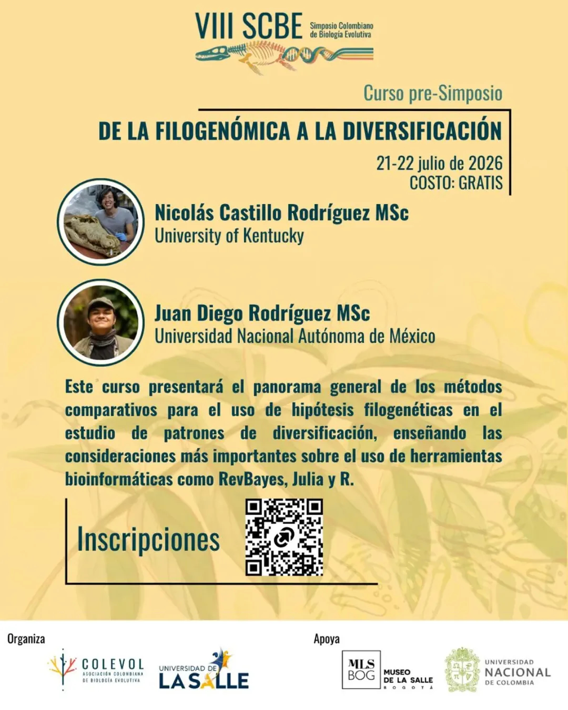

# De la filogenómica a la diversificación

Este taller tiene como objetivo mostrar a los participantes el panorama general de los métodos comparativos disponibles para el uso de hipótesis filogenéticas en el estudio de patrones de diversificación, además de enseñar a los participantes las consideraciones más importantes sobre el uso de herramientas bioinformáticas como RevBayes, Julia y R  para su implementación. Este se dividirá en dos ejes temáticos principales: Detección de la heterogeneidad en índices de diversificación y prueba de hipótesis sobre diversificación dependiente de caracteres (SSE). Los cuales contarán cada uno con una introducción teórica y un taller práctico para su aplicación. 

La primera parte incluirá una introducción teórica acerca del estudio de los patrones de diversificación, su importancia en la biología evolutiva y el concepto de historia natural filogenética. Posteriormente, se describirán, aplicarán y compararán tres metodologías (BAMM, ClaDS y pesto) que permiten cuantificar la heterogeneidad en las tasas de diversificación que puede presentar un determinado grupo de organismos. 

En la segunda parte se realizará una introducción al modelado de evolución de caracteres discretos y su aplicación en prueba de hipótesis de diversificación dependiente de caracteres. Se introducirá el concepto de caracteres escondidos y su importancia para descartar asociaciones erróneas entre caracteres y diversificación. Posteriormente se implementará la metodología de BiSSE y HiSSE en el lenguaje RevBayes, junto al análisis del modelo gráfico asociado a estos modelos. Finalmente se expondrán las extensiones de estos modelos y se realizará una sesión de discusión, preguntas y respuestas al respecto.

