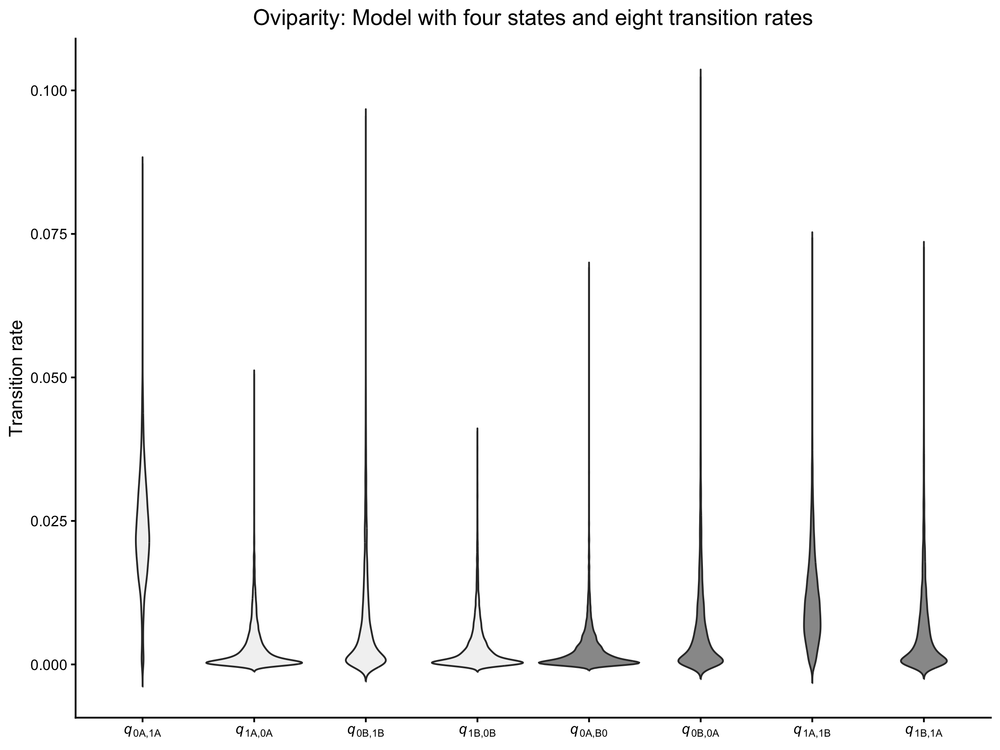
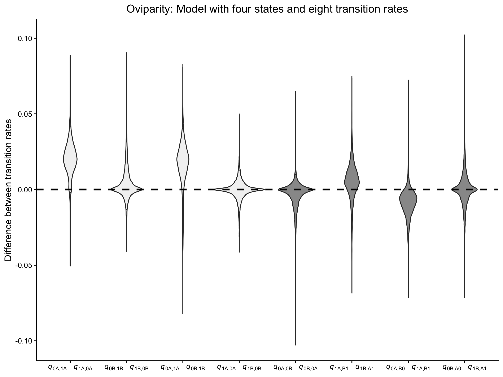
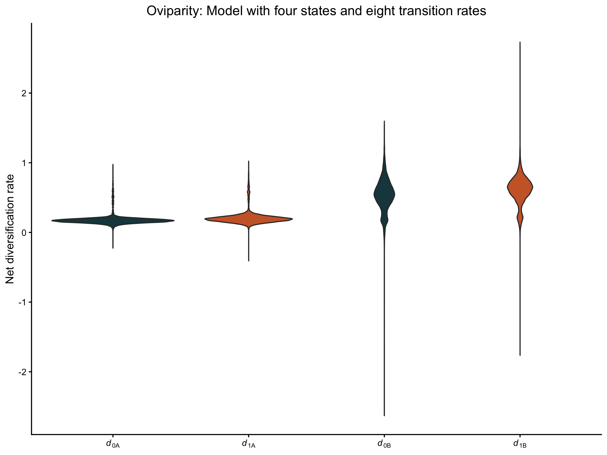
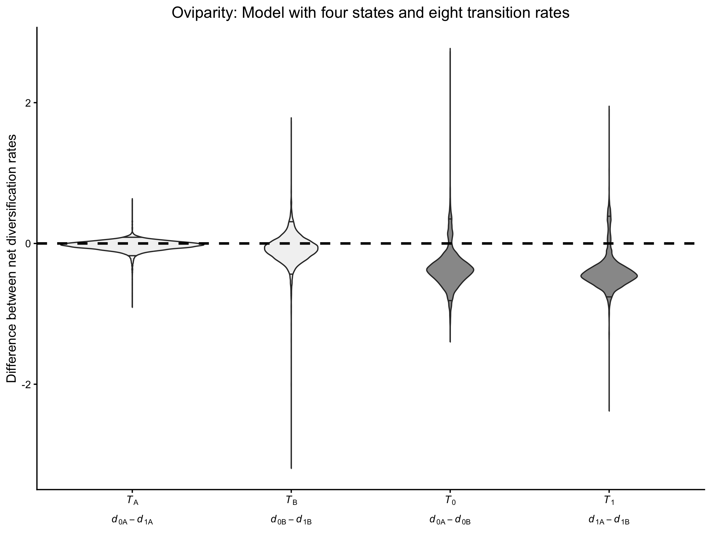
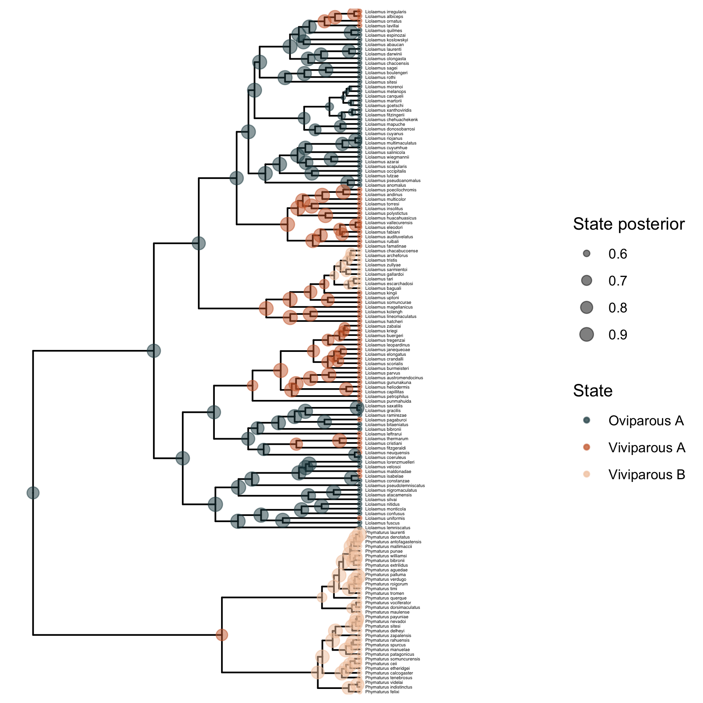

Tutorial y script creado por Rosana Zenil-Ferguson y Nicolás
Castillo-Rodríguez. Actualizado por Nicolás en Julio 2026.

En este tutorial vamos a describir cómo especificar un modelo de
diversificación dependiente del caracter (SSE - State dependent
speciation and extinction model) que incluye dos estados observados (0 y
1)y dos estados escondidos (A y B). Al realizar este análisis en un
contexto Bayesiano empleando RevBayes, podemos distinguir escenarios de
diversificación independiente del caracter (CID - Character independent
diversification), diversificación dependiente del caracter (BiSSE -
Binary SSE), diversificación dependiente de estados escondidos (HiSSE),
o escenarios intermedios. Consecuentemente, este marco conceptual que
estamos implementando se puede expandir para incorporar estados
observados o escondidos adicionales acorde a la pregunta de
investigación a responder.

## Datos a emplear

Para este tutorial vamos a utilizar los datos generados por Esquerré et
al. (2019) y Domínguez-Guerrero et al. (2024), quienes evalúan el efecto
de la viviparidad en la evolución de Liolaemidae.

Crea un nuevo directorio llamado `hisse_tutorial`. Dentro de este, crea
una carpeta llamada `data` donde guardaremos lo siguientes archivos:

-   [Filogenia Liolaemidae](downloads/Liolaemidae_146.tree):
    Desarrollada por Esquerré et al. 2019
    (<https://doi.org/10.1111/evo.13657>)
-   [Datos viviparidad
    Liolaemidae](downloads/liolaemidae_viviparity.csv): Desarrollada por
    Domínguez-Guerrero et al. 2024 (<https://doi.org/10.1038/s41467-024-49464-x>)y completada por Juan Diego Rodríguez para Phymaturus.    
-   [Script completo](downloads/hisse_8_transitions.Rev)

En total contamos con una filogenia con 146 especies, de las cuales
contamos información sobre viviparidad para todas. Sin embargo, RevBayes
puede acomodarse a especies para las que no tenemos datos de caracter,
indicando "?". En este set de datos, hemos descrito como 0 las especies
ovoviparas y como 1 las especies viviparas.

## Describiendo un HiSSE en RevBayes

Siguiendo la hipótesis de Esquerré et al. (2019), queremos prbar si la
viviparidad tiene un efecto sobre la diversificación de Liolaemidae. Por
lo tanto, hemos descrito un modelo HiSSE en el que se permite libremente
la estimación de todas las tasas de trancisiones entre estados.

Hemos especificado un total de cuatro tasas de especiación
(*λ*), cuatro tasas de extinción (*μ*), y ocho tasas que corresponden a
transiciones anagenéticas (*q*). La notación de las tasas de transición
indica el estado ancestral y derivado, separado por una coma.

Antes de continuar, dibuja el modelo gráfico propuesto.

### Cargando los datos en RevBayes

En este ejemplo, tenemos dos estados observados (0 y 1) y definimos dos
estados escondidos (A y B). Por lo tanto, contamos con cuatro estados
(0A, 1A, 0B, 1B), cada uno con su propia tasa de diversificación, es
decir, estableceremos cuatro tasas de especiación y cuatro tasas de
extinción.

```         
NUM_STATES <- 2
NUM_HIDDEN <- 2
NUM_RATES = NUM_STATES * NUM_HIDDEN
```

Utilizando las funciones `readTrees` y `readCharacterDataDelimited`,
cargamos en RevBayes los archivos con la filogenia y caracteres a
utilizar.

```         
observed_phylogeny <- readTrees("data/MCC_AFRICANRESTIOS.tre")[1]

data <- readCharacterDataDelimited("data/Elevation_322spp.tsv",
                                   stateLabels=2,
                                   type="NaturalNumbers",
                                   delimiter="\t",
                                   header=FALSE)
```

Con la función `expandCharacters` extendemos nuestros datos de 0 y 1, a
0A, 0B, 1A y 1B.

```         
data_exp <- data.expandCharacters(NUM_HIDDEN)
```

Finalmente, creamos un vector `moves` que guarda las propuestas de
movimientos que estableceremos para cada parámetro. Así mismo, el vector
`monitors` guarda la inferencia obtenida del modelo, incluyendo la
distribución posterior para cada uno de los parámetros.

```         
moves = VectorMoves()
monitors = VectorMonitors()
```

### Especificando las tasas de transición

Para las tasas de transición en nuestro modelo, utilizaremos
distribuciones Gamma para nuestros *a priori*. A cada parámetro
asignmaos un movimiento específico:

```         
shape_pr <- 0.5
rate_pr := observed_phylogeny.treeLength()/10

#Transiciones entre estados observados
q_0A1A ~ dnGamma(shape=shape_pr, rate=rate_pr)
q_1A0A ~ dnGamma(shape=shape_pr, rate=rate_pr)
q_0B1B ~ dnGamma(shape=shape_pr, rate=rate_pr)
q_1B0B ~ dnGamma(shape=shape_pr, rate=rate_pr)
#Transiciones entre estados escondidos
q_0A0B ~ dnGamma(shape=shape_pr, rate=rate_pr)
q_0B0A ~ dnGamma(shape=shape_pr, rate=rate_pr)
q_1A1B ~ dnGamma(shape=shape_pr, rate=rate_pr)
q_1B1A ~ dnGamma(shape=shape_pr, rate=rate_pr)

moves.append(mvSlice(q_0A1A, window = 0.1, weight=2, search_method = "stepping_out"))
moves.append(mvSlice(q_1A0A, window = 0.1, weight=2, search_method = "stepping_out"))
moves.append(mvSlice(q_0B1B, window = 0.1, weight=2, search_method = "stepping_out"))
moves.append(mvSlice(q_1B0B, window = 0.1, weight=2, search_method = "stepping_out"))

moves.append(mvSlice(q_0A0B, window = 0.1, weight=2, search_method = "stepping_out"))
moves.append(mvSlice(q_0B0A, window = 0.1, weight=2, search_method = "stepping_out"))
moves.append(mvSlice(q_1A1B, window = 0.1, weight=2, search_method = "stepping_out"))
moves.append(mvSlice(q_1B1A, window = 0.1, weight=2, search_method = "stepping_out"))
```

Vamos a revisar la forma de las distribuciones de nuestros priors en
<https://mikeryanmay.shinyapps.io/plotprior/> , por qué establecemos
estos valores?

Para definir la Q matriz, vamos primero a crear un matriz con valores de
0 que posteriormente reemplazaremos con los elementos adecuados según
las tasas de transición. En la Q matriz, las posiciones corresponden a:
1=0A, 2=1A, 3=0B, y 4=1B:

```         
for (i in 1:NUM_RATES) {
    for (j in 1:NUM_RATES) {
        q[i][j] := 0.0
    }
}

q[1][2] := q_0A1A
q[2][1] := q_1A0A
q[1][3] := q_0A0B
q[3][1] := q_0B0A
q[2][4] := q_1A1B
q[4][2] := q_1B1A
q[3][4] := q_0B1B
q[4][3] := q_1B0B
```

Establecemos la Q matriz mediante la función `fnFreeK`. La Q matriz es
una matriz infinitesimal, lo que significa que es la derivada de la
matriz de probabilidades:

```         
rate_matrix := fnFreeK(q, rescaled=false, matrixExponentialMethod="scalingAndSquaring")
```

### Especificando las tasas de diversificación

Con el fin de establecer las tasas de diversificación, usaremos un
multiplicador llamado `speciation_alpha` para los estados cuyo valor
escondido correpsonda a A, al que sumaremos un parámetro definido como
`speciation_beta` para los estados cuyo estado escondido corresponda a
B. Definimos los valores de diversificación de esta manera ya que
teóricamente los estados A y B derivan del mismo estado observado.

```         
# Priors para las tasas de diversificación
total_taxa <- observed_phylogeny.ntips()
root_age <- observed_phylogeny.rootAge()
half_sd <- 0.5
rate_mean <- ln(ln(total_taxa/2.0) / root_age)
rate_sd <- 2 * half_sd
```

Especiación y extinción definidas a partir de una distribución log
normal, definida primero a partir de una distribución normal que
posteriormente exponenciamos. Definimos la mediana de esta distribución
como el estadístico $$\frac{\log(N/2)}{T}$$ Este corresponde a la tasa
de diversificación esperada en un modelo de nacimiento sin extinción
(Ver Magallón y Sanderson 2001:
<https://doi.org/10.1111/j.0014-3820.2001.tb00826.x> ).

```         
for (i in 1:NUM_STATES) {

    speciation_alpha[i] ~ dnNormal(mean=rate_mean,sd=rate_sd)
    moves.append(mvSlide(speciation_alpha[i],delta=0.20,tune=true,weight=2.0))
    moves.append(mvSlice(speciation_alpha[i],window = 0.1, weight=2, search_method = "stepping_out"))

    extinction_alpha[i] ~ dnNormal(mean=rate_mean,sd=rate_sd)
    moves.append(mvSlide(extinction_alpha[i],delta=0.20,tune=true,weight=2.0))
    moves.append(mvSlice(extinction_alpha[i],window = 0.1, weight=2, search_method = "stepping_out"))

}

for (i in 1:(NUM_HIDDEN-1)) {

    speciation_beta[i] ~ dnNormal(0.0,1.0)
    moves.append(mvSlice(speciation_beta[i],window = 0.1, weight=2, search_method = "stepping_out"))
    moves.append(mvSlide(speciation_beta[i],delta=0.20,tune=true,weight=2.0))

    extinction_beta[i] ~ dnNormal(0.0,1.0)
    moves.append(mvSlice(extinction_beta[i],window = 0.1, weight=2, search_method = "stepping_out"))
    moves.append(mvSlide(extinction_beta[i],delta=0.20,tune=true,weight=2.0))

}

for (j in 1:NUM_HIDDEN) {
    for (i in 1:NUM_STATES) {
        if ( j == 1) {
            speciation[i] := exp( speciation_alpha[i] )
            extinction[i] := exp( extinction_alpha[i] )
        } else {
            index = i+(j*NUM_STATES)-NUM_STATES
            speciation[index] := exp( speciation_alpha[i] + speciation_beta[j-1] )
            extinction[index] := exp( extinction_alpha[i] + extinction_beta[j-1] )
        }
    }
}

net_diversification := speciation - extinction
```

### Estimación del caracter en la raíz del árbol

Ya que desconocemos si el ancestro común más reciente de todos los
taxones de nuestra filogenia era viviparo u oviparo, necesitamos estimar
el valor del caracter en la raíz del árbol. En el marco de la
estadística bayesiana, las frecuencias en la raíz son dos parámetros
adicionales que debemos estimar. Por lo tanto, asumiremos frecuencias
iniciales iguales para cada estado. Dado que hay dos estados,
necesitaremos una distribución *a priori* bivariada para un vector con
dos frecuencias que sumen 1. Una distribución muy útil para este
propósito es la distribución de Dirichlet, una distribución de
probabilidad multivariada que nos permite asignar la misma frecuencia a
ambos estados.

```         
root_frequencies ~ dnDirichlet(rep(1,NUM_RATES))
moves.append(mvDirichletSimplex(root_frequencies,tune=true,weight=2))
moves.append(mvElementSwapSimplex(root_frequencies, weight=2))
```

### Especificación de la fracción del muestreo

Para modelos de diversificación necesitamos especificar la proporción de
linajes del clado que fueron muestreadas en nuestra filogenia:

```         
# Liolaemus: 280, Phymaturus: 52

total_clade <- 332
extant_sampling <- total_taxa/total_clade
```

### Construir modelo HiSSE

Con el fin de conectar todos los nodos de este modelo, utilizaremos una
distribución de probabilidad para árboles filogenéticos. Esta
distribución de probabilidad es la que calcula internamente la función
de verosimilitud a lo largo del árbol y considera la distribución *a
priori* de los parámetros en toda la estructura del árbol.

```         
#  La función dnCDBDP (Character-dependent birth-death process) establece una distribución de probabilidad para un modelo de Markov que es un proceso de nacimiento y muerte dependiente de caracter a lo largo del árbol filogenético.

hisse ~ dnCDBDP(rootAge         = root_age,
                speciationRates = speciation,
                extinctionRates = extinction,
                Q               = rate_matrix,
                pi              = root_frequencies,
                rho             = extant_sampling)
```

Utilizamos la función `clamp` que permite que la función `dnCDBDP()`
tenga en cuenta los datos.

```         
hisse.clamp(observed_phylogeny)
hisse.clampCharData(data_exp) 
```

### Guardar nuestra inferencia

A lo largo del código hemos especificado distintos `moves` que
corresponden a las propuestas del MCMC para cada parámetro:

Breve descripción de las propuestas:

-   `mvScale(q_0A1A, weight=2)` esta propuesta reescala el valor
    original de $$q_{0A1A}$$ dos veces por iteración.
-   `mvSlide(speciation_alpha[i],delta=0.20,tune=true,weight=2.0)` esta
    propuesta define una ventana que se desliza a través de los valores
    del parámetro y ajusta el tamaño de la ventana a medida que avanza
    el MCMC.
-   `mvDirichletSimplex(root_frequencies,tune=true,weight=2)` esta
    función propone dos valores en el intervalo (0,1) cuya suma es igual
    a 1. Estos representan la frecuencia con la que encontraríamos el
    estado 0 o el estado 1 en la raíz del árbol.
-   `mvElementSwapSimplex(root_frequencies, weight=3)` esta función
    propone intercambiar las frecuencias. Por ejemplo, si tenemos (0.4,
    0.6), elementswap intercambia la posición de esos valores,
    resultando en (0.6, 0.4).

Cada una de estas propuestas contribuye a los *momios a posteriori*, si
estos mejoran, la propuesta puede ser entonces aceptada.

#### Guardar modelo gráfico

Este es un paso importante en el software RevBayes. Queremos “guardar”
todo el objeto gráfico para poder manipularlo posteriormente. La función
`model()` nos permite hacer esto.

```         
mymodel = model(rate_matrix)
```

#### Especificar monitores

Los monitores almacenan toda nuestra inferencia; sin ellos no será
posible recuperar las distribuciones posteriores. Existen muchos tipos
de monitores, como se muestra a continuación:

```         
monitors.append(mnModel(filename="output/hisse_liolaemus.log", printgen=10))
#monitors.append(mnJointConditionalAncestralState(tree=hisse, cdbdp=hisse, type="NaturalNumbers", printgen=500, withTips=true, withStartStates=false, filename="output/asr_hisse_liolaemus.log"))
#monitors.append(mnStochasticCharacterMap(cdbdp=hisse,printgen=500,filename="output/stochmap_hisse_liolaemus.log", include_simmap=true))
monitors.append(mnScreen(printgen=10, speciation, extinction, net_diversification))
```

-   `mnModel` guarda las muestras de la distribución posterior generadas
    por el algoritmo MCMC.
-   `mnScreen` imprime información en pantalla para saber que el
    análisis está en ejecución.
-   `mnJointConditionalAncestralState` guarda la reconstrucción de
    estados ancestrales utilizando la probabilidad posterior marginal
    (esto es muy diferente a lo que hacen phytools u otros programas).
-   `mnStochasticCharacterMap` calcula mapas estocásticos de caracteres,
    es decir, las transiciones que ocurren a lo largo de las ramas. Esto
    es muy importante, pero también muy difícil de calcular.

#### Ejecutar el MCMC

En lugar de establecer un número fijo de generaciones, establecemos que
el análisis se ejecute hasta que todos los parámetros en el modelo
tengan un tamaño de muestra efectivo de al menos 250. Así mismo,
incluimos checkpoints con el fin de retomar nuestro análisis si este es
interrumpido.

```         
mymcmc = mcmc(mymodel, monitors, moves, nruns=2, moveschedule="random")

#mymcmc.initializeFromCheckpoint("output/hisse_liolaemus.state")

stopping_rules[1] = srMinESS(250, file = "output/hisse_liolaemus.log", freq = 10000)

mymcmc.run(rules = stopping_rules, checkpointInterval = 1000, checkpointFile = "output/hisse_liolaemus.state")

#mymcmc.run(generations = 250000, checkpointInterval = 1000, checkpointFile = "output/hisse_liolaemus.state")
```

#### Crear resumen de reconstrucción ancestral de caracter

Para resumir los estados ancestrales muestreados durante el análisis y
posteriormente plotearlos usando RevGadgets, podemos usar las funciones
`readAncestralStateTrace` y `ancestralStateTree` en RevBayes.

```         
anc_states = readAncestralStateTrace("output/asr_hisse_liolaemus_run_1.log")

anc_tree = ancestralStateTree(tree=observed_phylogeny,ancestral_state_trace_vector=anc_states, include_start_states=false, file="output/asr_summary_hisse_liolaemus_run_1.tree", burnin=0.1, summary_statistic="MAP", site = 1)
```

## Convergencia del MCMC

Vamos a emplear Tracer para observar los resultados del MCMC

-   [Primera corrida del MCMC](downloads/hisse_liolaemus_run_1.log)
-   [Segunda corrida del MCMC](downloads/hisse_liolaemus_run_2.log)

## Pruebas de hipótesis

En esta sección, describimos cómo evaluar las diferencias en las tasas
de transición y diversificación mediante la construcción de estadísticos
de prueba a partir de muestras a posteriori. Estos estadísticos se
definen como las diferencias entre las distribuciones a posteriori de
dos tasas de transición o diversificación. Este enfoque ofrece una
alternativa al proceso de selección de modelos empleados en análisis
basados ​​en verosimilitud, en los cuales la inferencia depende del
conjunto específico de modelos que se comparan.

### Asimetrías en tasas de transición

El modelo especificado permite tasas de transición asimétricas. Estas
asimetrías pueden evaluarse calculando la diferencia entre las
distribuciones a posteriori de pares de tasas de transición:

$$
T_q =q_{i,j} - q_{j,i}
$$

En R, carga las librerías requeridas y utilizando los outputs del monito
`mnModel` de RevBayes, que contiene las muestras a posteriori de los
parámetros estimados, y descarta el primer 10% de las muestras como
burn-in. Esta fracción varía entre análisis de acuerdo a la convergencia
de las cadenas de Markov.

```         
library(ggplot2)
library(dplyr)

hisse_run_1<- read.table("output_tp/hisse_liolaemus_run_1.log", header=TRUE)
hisse_run_1<- hisse_run_1[-seq(1,1700,1),]
```

Posteriormente, creamos un data frame con las transiciones estimadas y
las visualizamos usando `ggplot2`. Qué tasas de transición son
diferentes?

```         
#Transition rates

transition_rates_hisse_run_1 <- 
  data.frame(
  dens=c(hisse_run_1$q_0A1A,hisse_run_1$q_1A0A, hisse_run_1$q_0B1B,hisse_run_1$q_1B0B, 
         hisse_run_1$q_0A0B,hisse_run_1$q_0B0A, hisse_run_1$q_1A1B,hisse_run_1$q_1B1A),
  rate=rep(c("q_0A1A","q_1A0A","q_0B1B","q_1B0B","q_0A0B","q_0B0A","q_1A1B","q_1B1A"),each=length(hisse_run_1$q_0A1A)))

transition_rates_hisse_run_1$rate <- 
  factor(transition_rates_hisse_run_1$rate,
         levels = c("q_0A1A","q_1A0A","q_0B1B","q_1B0B","q_0A0B","q_0B0A","q_1A1B","q_1B1A"))

transition_rates_hisse_run_1_plot <- 
  ggplot(transition_rates_hisse_run_1,aes(x=rate,y=dens, fill=rate))+
  geom_violin(trim=FALSE)+
  scale_fill_manual(values = c("q_0A1A" = "gray95", "q_1A0A" = "gray95", "q_0B1B" = "gray95", "q_1B0B" = "gray95",
                               "q_0A0B" = "gray60", "q_0B0A" = "gray60", "q_1A1B" = "gray60", "q_1B1A" = "gray60")) +
  labs(title="Oviparity: Model with four states and eight transition rates", x = NULL, y = "Transition rate")+
  theme_classic() +
  theme(legend.position = "none",  plot.title = element_text(hjust = 0.5)) +
  scale_x_discrete(labels = c("q_0A1A" = expression(italic(q)["0A,1A"]), "q_1A0A" = expression(italic(q)["1A,0A"]),
                              "q_0B1B" = expression(italic(q)["0B,1B"]), "q_1B0B" = expression(italic(q)["1B,0B"]),
                              "q_0A0B" = expression(italic(q)["0A,B0"]), "q_0B0A" = expression(italic(q)["0B,0A"]),
                              "q_1A1B" = expression(italic(q)["1A,1B"]), "q_1B1A" = expression(italic(q)["1B,1A"])))

transition_rates_hisse_run_1_plot
```


Para formalmente identificar si la tasa $q_{0A,1A}$ difiere del resto,
comparamos las diferencias entre las distribuciones posteriores entre
las tasas de trasición. Consideraos que las tasas de transición son
diferentes si el 95% del intervalo de credibilidad de su diferencia
posterior correspondiente no incluye 0.

```         
#Are transitions different?

test_transition_rates_hisse_run_1 <-
  data.frame(dens=c(hisse_run_1$q_0A1A - hisse_run_1$q_1A0A, hisse_run_1$q_0B1B - hisse_run_1$q_1B0B,
                    hisse_run_1$q_0A1A - hisse_run_1$q_0B1B, hisse_run_1$q_1A0A - hisse_run_1$q_1B0B,
                    hisse_run_1$q_0A0B - hisse_run_1$q_0B0A, hisse_run_1$q_1A1B - hisse_run_1$q_1B1A,
                    hisse_run_1$q_0A0B - hisse_run_1$q_1A1B, hisse_run_1$q_0B0A - hisse_run_1$q_1B1A),
  difference=rep(c("q_0A1A - q_1A0A", "q_0B1B - q_1B0B", 
                   "q_0A1A - q_0B1B", "q_1A0A - q_1B0B",
                   "q_0A0B - q_0B0A", "q_1A1B - q_1B1A",
                   "q_0A0B - q_1A1B", "q_0B0A - q_1B1A"),
                   each=length(hisse_run_1$q_0A1A)))

test_transition_rates_hisse_run_1$difference <- 
  factor(test_transition_rates_hisse_run_1$difference,
         levels = c("q_0A1A - q_1A0A", "q_0B1B - q_1B0B",
                    "q_0A1A - q_0B1B", "q_1A0A - q_1B0B",
                    "q_0A0B - q_0B0A", "q_1A1B - q_1B1A",
                    "q_0A0B - q_1A1B", "q_0B0A - q_1B1A"))

test_transition_rates_hisse_run_1_plot <- 
    ggplot(test_transition_rates_hisse_run_1, aes(x = difference, y = dens, fill = difference)) +
    geom_violin(trim=FALSE, quantiles = c(0.025, 0.975), quantile.linetype = 1) +
    scale_fill_manual(values = c("q_0A1A - q_1A0A" = "gray95",
                                 "q_0B1B - q_1B0B" = "gray95",
                                 "q_0A1A - q_0B1B" = "gray95",
                                 "q_1A0A - q_1B0B" = "gray95",
                                 "q_0A0B - q_0B0A" = "gray60",
                                 "q_1A1B - q_1B1A" = "gray60",
                                 "q_0A0B - q_1A1B" = "gray60",
                                 "q_0B0A - q_1B1A" = "gray60")) +
    labs(title = "Oviparity: Model with four states and eight transition rates", y = "Difference between transition rates", x = NULL) +
    geom_hline(yintercept = 0, linetype = "dashed", lwd = 1) +
    theme_classic() +
    theme(legend.position = "none",  plot.title = element_text(hjust = 0.5)) +
    scale_x_discrete(labels = c("q_0A1A - q_1A0A" = expression(italic(q)["0A,1A"] - italic(q)["1A,0A"]),
                                "q_0B1B - q_1B0B" = expression(italic(q)["0B,1B"] - italic(q)["1B,0B"]),
                                "q_0A1A - q_0B1B" = expression(italic(q)["0A,1A"] - italic(q)["0B,1B"]),
                                "q_1A0A - q_1B0B" = expression(italic(q)["1A,0A"] - italic(q)["1B,0B"]),
                                "q_0A0B - q_0B0A" = expression(italic(q)["0A,0B"] - italic(q)["0B,0A"]),
                                "q_1A1B - q_1B1A" = expression(italic(q)["1A,B1"] - italic(q)["1B,A1"]),
                                "q_0A0B - q_1A1B" = expression(italic(q)["0A,B0"] - italic(q)["1A,B1"]),
                                "q_0B0A - q_1B1A" = expression(italic(q)["0B,A0"] - italic(q)["1B,A1"])))

test_transition_rates_hisse_run_1_plot
```



Definimos numéricamente el valor de estas diferencias:

```         
quantile <- test_transition_rates_hisse_run_1 %>%
  group_by(difference)%>%reframe(res=quantile(dens,probs=c(0.025,0.975)))

quantile

## A tibble: 16 × 2
#   difference           res
#   <fct>              <dbl>
# 1 q_0A1A - q_1A0A -0.00193
# 2 q_0A1A - q_1A0A  0.0419 
# 3 q_0B1B - q_1B0B -0.0131 
# 4 q_0B1B - q_1B0B  0.0320 
# 5 q_0A1A - q_0B1B -0.0242 
# 6 q_0A1A - q_0B1B  0.0404 
# 7 q_1A0A - q_1B0B -0.0150 
# 8 q_1A0A - q_1B0B  0.0129 
# 9 q_0A0B - q_0B0A -0.0283 
#10 q_0A0B - q_0B0A  0.0100 
#11 q_1A1B - q_1B1A -0.0203 
#12 q_1A1B - q_1B1A  0.0277 
#13 q_0A0B - q_1A1B -0.0293 
#14 q_0A0B - q_1A1B  0.00781
#15 q_0B0A - q_1B1A -0.0255 
#16 q_0B0A - q_1B1A  0.0267 
```

### Asimetrías en tasas de diversificación

La principal ventaja de incorporar estados ocultos en los modelos SSE es
que proporcionan una hipótesis nula más adecuada, representada por un
modelo CID-2, en el que se permite que las tasas de diversificación
varíen independientemente de los estados observados. Este marco reduce
sustancialmente el error de tipo I al tener en cuenta la heterogeneidad
en las tasas de diversificación no relacionada con el rasgo de interés:

$$
H_0:
\begin{cases}
d_{0A} = d_{1A} \;\text{   y   }\; d_{0B} = d_{1B} \\
d_{0A} \neq d_{0B} \;\text{   y   }\; d_{1A} \neq d_{1B}
\end{cases}
$$

Para evaluar las diferencias en las tasas de diversificación en un marco
bayesiano, proponemos estadísticos de prueba derivados de muestras a
posteriori obtenidas mediante el ajuste de un modelo HiSSE totalmente
parametrizado. Las diferencias en las tasas de diversificación neta
entre los estados observados se definen como:

$$
T_A = d_{0A} - d_{1A} \text{   y   }\ T_B = d_{0B} - d_{1B}
$$ De manera similar, las diferencias en las tasas de diversificación
neta entre estados ocultos se definen como: $$
T_0 = d_{0A} - d_{0B} \text{   y   }\ T_1 = d_{1A} - d_{1B}
$$

Por lo tanto, la hipótesis nula $H_0$ puede evaluarse utilizando estos
estadísticos. Un modelo CID-2 es soportada cuando los intervalos de
credibilidad del 95 % para $T_A$ y $T_B$ incluyen a cero, mientras que
los correspondientes a $T_0$ y $T_1$ lo excluyen.

```         
#Net diversification

net_diversification_hisse_run_1<- 
  data.frame(dens=c(hisse_run_1$net_diversification.1., hisse_run_1$net_diversification.2.,
                    hisse_run_1$net_diversification.3., hisse_run_1$net_diversification.4.),
             rate=rep(c("net_div_0A","net_div_1A","net_div_0B","net_div_1B"),
             each=length(hisse_run_1$net_diversification.1.)))

net_diversification_hisse_run_1$rate <- factor(net_diversification_hisse_run_1$rate,
                                        levels = c("net_div_0A","net_div_1A","net_div_0B","net_div_1B"))

net_diversification_hisse_run_1_plot <- 
  ggplot(net_diversification_hisse_run_1,aes(x=rate,y=dens, fill=rate))+
  geom_violin(trim=FALSE)+
  scale_fill_manual(values = c("net_div_0A" = "#1d454d", "net_div_1A" = "#cc6633", "net_div_0B" = "#1d454d", "net_div_1B" = "#cc6633")) +
  labs(title = "Oviparity: Model with four states and eight transition rates", y = "Net diversification rate", x = NULL) +
  theme_classic() +
  theme(legend.position = "none",  plot.title = element_text(hjust = 0.5)) +
  scale_x_discrete(labels = c("net_div_0A" = expression(italic(d)["0A"]), "net_div_1A" = expression(italic(d)["1A"]),
                              "net_div_0B" = expression(italic(d)["0B"]), "net_div_1B" = expression(italic(d)["1B"])))

net_diversification_hisse_run_1_plot
```



Qué tasas de diversificación son diferentes? Qué escenario se soporta?

```         
#Is net diversification different?

test_net_diversification_hisse_run_1 <-
  data.frame(dens=c(hisse_run_1$net_diversification.1. - hisse_run_1$net_diversification.2.,
                    hisse_run_1$net_diversification.3. - hisse_run_1$net_diversification.4.,
                    hisse_run_1$net_diversification.1. - hisse_run_1$net_diversification.3.,
                    hisse_run_1$net_diversification.2. - hisse_run_1$net_diversification.4.),
                    difference=rep(c("T_A","T_B","T_0","T_1"),
                    each=length(hisse_run_1$net_diversification.1.)))

test_net_diversification_hisse_run_1$difference <- factor(test_net_diversification_hisse_run_1$difference,
         levels = c("T_A","T_B","T_0","T_1"))

test_net_diversification_hisse_run_1_plot <- 
    ggplot(test_net_diversification_hisse_run_1, aes(x = difference, y = dens, fill = difference)) +
    geom_violin(trim=FALSE, draw_quantiles = c(0.025, 0.975))+
    scale_fill_manual(values = c("T_A" = "gray95", "T_B" = "gray95", "T_0" = "gray60", "T_1" = "gray60")) +
    labs(title = "Oviparity: Model with four states and eight transition rates", y = "Difference between net diversification rates", x = NULL) +
    geom_hline(yintercept = 0, linetype = "dashed", lwd = 1) +
    theme_classic() +
    theme(legend.position = "none",  plot.title = element_text(hjust = 0.5)) +
    scale_x_discrete(labels = c(
  "T_A" = expression(atop(italic(T)[A], italic(d)["0A"] - italic(d)["1A"])),
  "T_B" = expression(atop(italic(T)[B], italic(d)["0B"] - italic(d)["1B"])),
  "T_0" = expression(atop(italic(T)[0], italic(d)["0A"] - italic(d)["0B"])),
  "T_1" = expression(atop(italic(T)[1], italic(d)["1A"] - italic(d)["1B"]))
))

test_net_diversification_hisse_run_1_plot
```



```         
quantile <- test_net_diversification_hisse_run_1 %>%
  group_by(difference)%>%reframe(res=quantile(dens,probs=c(0.025,0.975)))

quantile

## A tibble: 8 × 2
#  difference     res
#  <fct>        <dbl>
#1 T_A        -0.174 
#2 T_A         0.0877
#3 T_B        -0.436 
#4 T_B         0.309 
#5 T_0        -0.812 
#6 T_0         0.348 
#7 T_1        -0.759 
#8 T_1         0.387 
```

Definir un único modelo HiSSE totalmente parametrizado
con todas las tasas de transición y diversificación neta estimadas
libremente es suficiente dentro de un marco bayesiano para evaluar
múltiples hipótesis de evolución anagenética y diversificación
dependiente del estado.

## Visualización de estados ancestrales

Utilizando la librería RevGadgets en R package podemos visualizar la
reconstrucción ancestral de caracter:

```         
devtools::install_github("revbayes/RevGadgets@development")
#Esta versión de RevGadgets incluye herramientas para la visualización de mapas estocásticos
library(RevGadgets)
```

Tras cargar RevGadgets, podemos visualizar la reconstrucción de estados
ancestrales cargando los archivos generados en RevBayes previamente:

-   [Output de
    ancestralStateTree](downloads/asr_summary_hisse_liolaemus_run_1.tree)

En primer lugar, utilizamos la función `processAncStates` para
especificar la ruta al resumen de la reconstrucción de estados
ancestrales. A continuación, empleamos `plotAncStatesMAP` para generar
el gráfico final, con la ayuda de un vector de colores predefinido.

```         
anc_states <- processAncStates(path = "output/asr_summary_hisse_liolaemus_run_1.tree",
                               state_labels=c("0"="Oviparous A",
                                              "1"="Viviparous A",
                                              "2"="Oviparous B",
                                              "3"="Viviparous B"))

colors <- setNames(c("#1d454d", "#cc6633","#8FB5BA","#F2C7AA"),
                   c("Oviparous A", "Viviparous A", "Oviparous B", "Viviparous B"))

plotAncStatesMAP(t = anc_states,
                 tree_layout="rectangular",
                 state_transparency = 0.5,
                 node_size = c(1, 4),
                 tip_labels_size = 1,
                 tip_labels_offset = 0.5,
                 node_color = colors)
```


